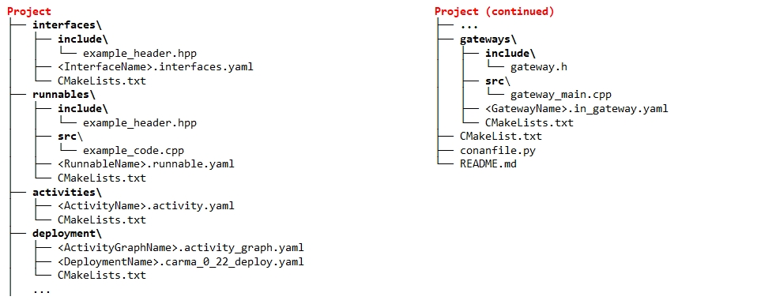
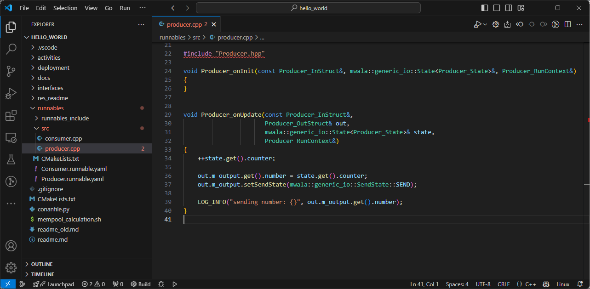
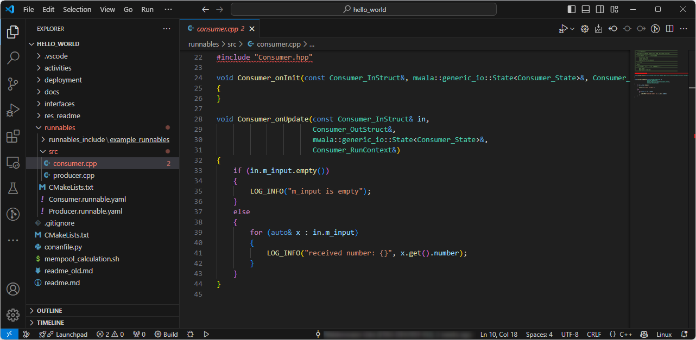
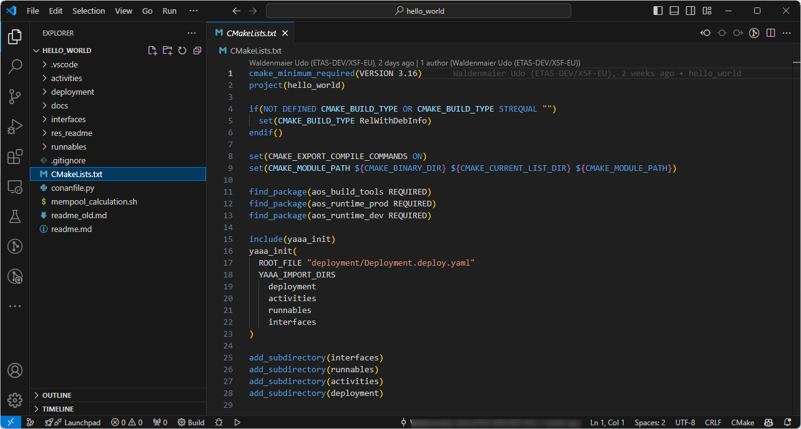
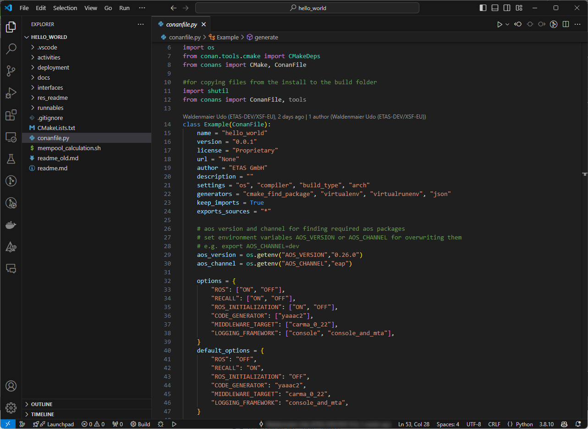

## Develop

In this section, we will explore how an application is typically developed using the YAAA (Yaml As an Architecture) language and C++.

<!--
In this section, we will develop an application using the YAAA (Yaml As an Architecture) language and C++.
-->

<!--
### Overview

- **YAAA**: Used for defining the architecture.
- **C++**: Used for writing business logic within Runnables.
- **Gateways**: Facilitate communication with the external environment.
- **Interfaces**: Define communication between Runnables, Activities, and Gateways.
- **Conan and CMake**: Used for build control (optional, other build environments can be used).
-->

### YAAA modeling elements and project structure

YAAA provides a set of YAML-based templates for modeling the software architecture of ADAS / AD systems.

The modeling elements are:

- **Interfaces** define data used for communication (defined in sub-directory `interfaces`)
- **Runnables** contain business logic in the form of C++ code (defined in sub-directory `runnables`)
- **Activities** define and represent executables that are assigned to POSIX processes (defined in sub-directory `activities`)
- **Activity graphs** define complete applications through instantiation of activities (defined in sub-directory `deployment` as YAML file with `_graph`)
- **Deployment** maps the software applications to concrete hardware entities (defined in sub-directory `deployment`)

The modeling elements are each specified in separate YAML files. These are typically organized in a corresponding directory structure within a project. 



Go through the directory structure and have a look at the different files in the above mentioned directories. 

### Business logic implementation in C++

The business logic is implemented in the in C++ in the Runnables which can be found '\runnables\src\'

C++ code for the Producer



<!--
```cpp 
#include "Producer.hpp"

void Producer_onInit(const Producer_InStruct&, mwala::generic_io::State<Producer_State>&, Producer_RunContext&)
{
}

void Producer_onUpdate(const Producer_InStruct&,
                       Producer_OutStruct& out,
                       mwala::generic_io::State<Producer_State>& state,
                       Producer_RunContext&)
{
    ++state.get().counter;

    out.m_output.get().number = state.get().counter;
    out.m_output.setSendState(mwala::generic_io::SendState::SEND);

    LOG_INFO("sending number: {}", out.m_output.get().number);
}
```
-->

C++ code for the Consumer



<!--
```cpp 
#include "Consumer.hpp"

void Consumer_onInit(const Consumer_InStruct&, mwala::generic_io::State<Consumer_State>&, Consumer_RunContext&)
{
}

void Consumer_onUpdate(const Consumer_InStruct& in,
                       Consumer_OutStruct&,
                       mwala::generic_io::State<Consumer_State>&,
                       Consumer_RunContext&)
{
    if (in.m_input.empty())
    {
        LOG_INFO("m_input is empty");
    }
    else
    {
        for (auto& x : in.m_input)
        {
            LOG_INFO("received number: {}", x.get().number);
        }
    }
}
```
-->

Each Runnable has two functions which are called by the middleware.

- The `onInit()` function is called once upon initializatiuon.
- The `onUpdate()` function is called whenever the runnable gets executed. It takes the values from the InStruct and the internal state and produces the values in the OutStruct.

Note that the `onInit()` function is not implemented as no initialization is necessary in the simple example.

<!--
### Steps to Develop the Application

1. **Set Up Your Development Environment**

- Ensure you have Visual Studio Code installed.
- Make sure the necessary VS Code extensions for AOS development are installed (refer to **[Visual Studio Code as IDE](docs/3-vscode.md)**).

2. **Create a New AOS Project**

- Use the `aos-yaaa-support` extension to create a preconfigured AOS project.
- Open Visual Studio Code and navigate to the Command Palette (**Ctrl+Shift+P**).
- Type `aos: create project` and follow the prompts to set up your project.

3. **Write Business Logic**

- Navigate to the `runnables/src` directory of your project.
- Create or edit C++ files to implement the business logic within Runnables.

4. **Define Architecture Using YAAA**

- Open the YAAA files in the respective directories.
- Inspect the Interfaces, Runnables, Activities and Deployment.

```yaml # ExampleInterfaces.interfaces.yaml:
yaaa_version: 0.5

interfaces:
  - type_name: Message
    cpp_type: consumer_producer_example::Message
    cpp_include: example_interfaces/message.hpp
```

-->

### **Build configuration with Conan and CMake**

The build configuration for the project is done using Conan and CMake.

In the `CMakeLists.txt` files of the sub-directories of the project, the YAAA modeling files and C++ files are added to the build system. Note that the SDK provides a set of macros - provided through YAAA CMake - to handle the contents more easily.



In the `conanfile.py`, project-wide settings for the actual build are defined.



### Tips

- When changing files, regularly save your work and commit changes to version control.
- Use the YAAA-CO and YAAAVis extensions for better development experience.

Let's proceed to the next section where we will build our project.

Previous section: [Introduction](../readme.md) | Next section: [Build](4-build.md)
