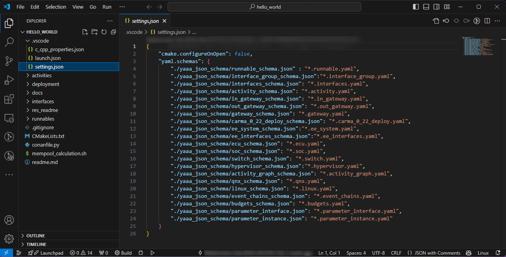
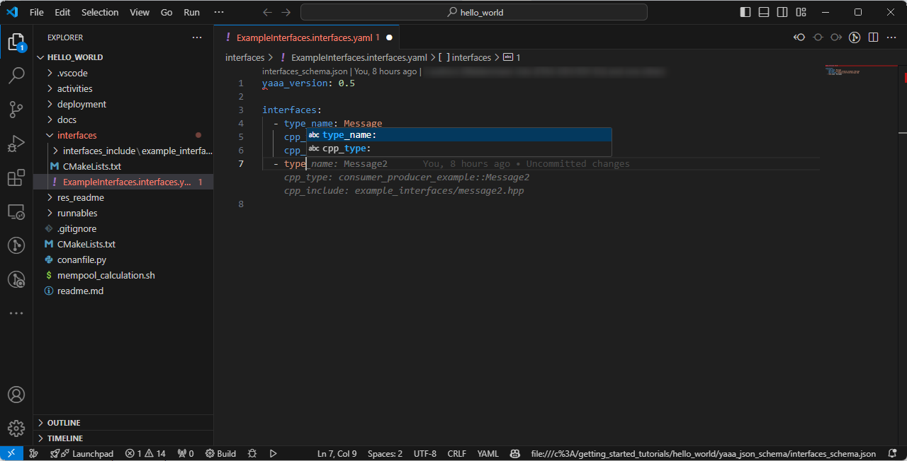

## Visual Studio Code as IDE

In this section, we will set up Visual Studio Code for AOS development. The AOS SDK comes with several extensions that enhance the development experience for AOS models.

### YAAA-CO Extension

YAAA-CO is an extension for Visual Studio Code that aids in developing YAAA projects by providing completion suggestions.

#### Prerequisite

- Reference the YAAA Schema Files in `settings.json`.

#### Usage

1. Open a YAAA file.
2. Start typing and press `Ctrl+Space` to get completion suggestions.

### YAAAVis Extension

YAAAVis visualizes the corresponding diagram for an open YAAA file inside a webview.

#### Usage

1. Open a YAML file in Visual Studio Code.
2. Open the Command Palette with `Ctrl+Shift+P`.
3. Type and select `YAAAVis VSCode Render`.

### aos-yaaa-support (Experimental)

Aos-yaaa-support is an extension that creates a preconfigured AOS project using a template. It also allows you to add AOS components such as runnables, activities, interfaces, and gateways.

#### Usage

1. Open the Command Palette with `Ctrl+Shift+P`.
2. Start typing `aos:` to see the list of available commands.
3. Select the desired command to create a project or add components.

### Summary

- **YAAA-CO Extension**: Helps with YAAA file completion.
- **YAAAVis Extension**: Visualizes YAAA diagrams.
- **aos-yaaa-support Extension**: Assists in creating and configuring AOS projects.

Previous section: [Develop](2-develop.md) | Next section: [Build](4-build.md)