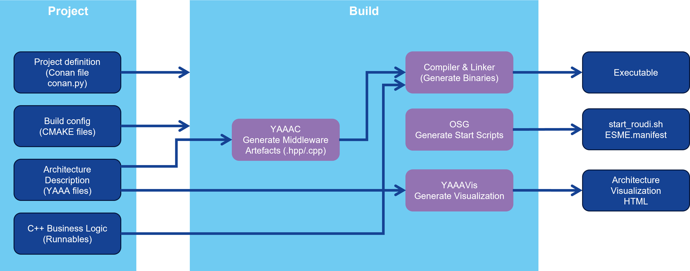
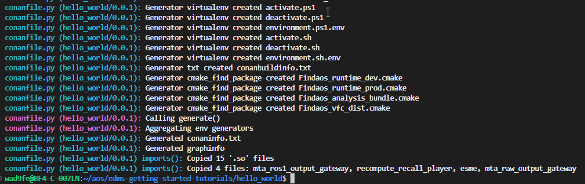
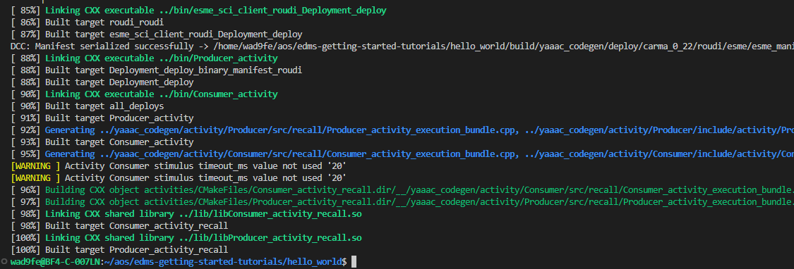

## Build

In this section, we will build the project using Conan and 
CMake. Follow these steps to ensure a successful build.

The figure below shows a high-level description of the build process:



* A project consists of the project configuration file (conan.py), CMAKELists files, architecture description files and the business logics implemented in C++ (runnables).
* The YAAA compiler reads the YAAA architecture description and generates middleware artefacts as defined in the project configuration.
* The generated middleware artefacts are compiled and linked together with the source code of the business logics and libraries of the SDK (e.g., the flowtracing library). This creates one or multiple executables.
* To launch the application, a start script and/or a configuration for the execution and state manager (ESME) are generated.
* To visualize the architecture, YAAAVis generates an interactive website based on the YAAA architecture description files. 

### Step-by-step build process

>Execute each of the commands in the root directory of the example.

1. Clean Previous Builds

    Before starting a new build, it's recommened to clean any previous build artifacts. This is especially important if the previous build was done for a different target.

    ```
    rm -rf install build 
    ```

2. Install dependencies

    Use Conan to install the necessary dependencies for your project.

    ```
    conan install . -if=install 
    ```

3. Build the project

    Build the project using CMake, specifying the install directory.

    ```
    conan build . -if=install -bf=build 
    ```

### Expected output

After running the above commands, you should see output indicating that the dependencies were installed and the project was built successfully.

Output after conan install:


Output after conan build:


Any errors encountered during this process will be displayed in the terminal. Make sure to resolve them before proceeding.

### Tips

- Ensure that your `conanfile.py` and `CMakeLists.txt` are correctly configured before starting the build process.
- Regularly clean your build environment to avoid conflicts.

Now that we have successfully built the project, let's move on to visualizing the model.

Previous section: [Develop](2-develop.md) | Next section: [Visualize](5-visualize.md)
