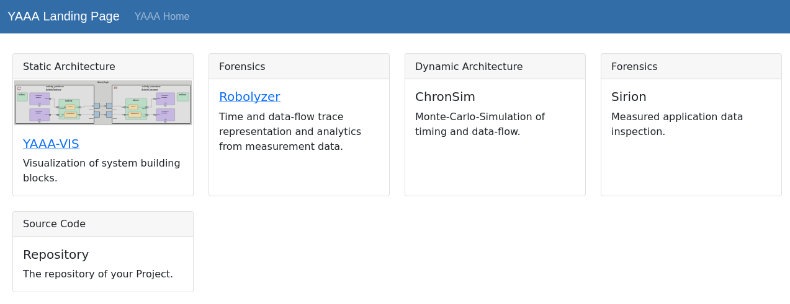
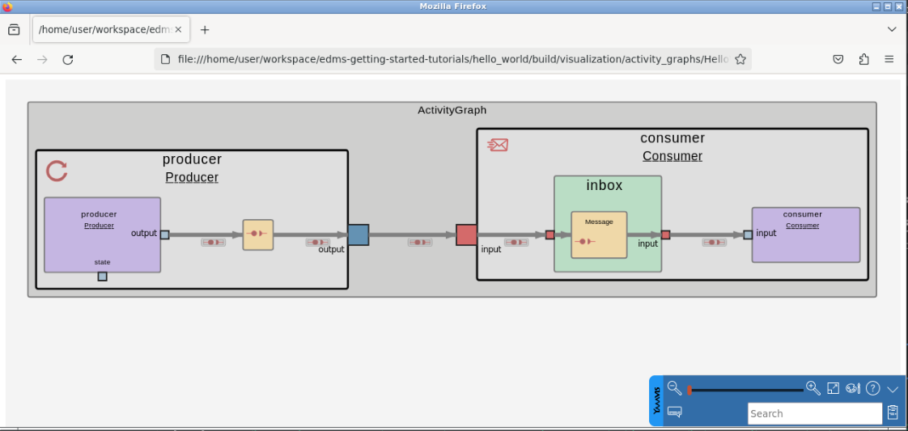

## Visualization

In this section, we will visualize the architecture model generated by the YAAA compiler (YAAAC) after a successful build.

### Viewing the architecture model in your browser

1. Locate the visualization file

    After the build, the YAAA compiler generates a visualization of your model. This file is located in the `./build/visualization` directory.

2. Open the visualization file

    Use your preferred web browser to open the `index.htm` file.

    ``` sh
    firefox build/visualization/index.htm 
    ```



Click on **YAAA-VIS** and then on **HelloWorld.activity_graph** to get to see your activity graph.



<!--
> ***TODO:*** Use an animated GIF to make it visually attractive.
-->

<!-- 

TODO: Evaluate how to use the YAAAVis Extension in EAP, SDK, WSL etc. 

### Using the YAAAVis Extension

The YAAAVis extension allows you to view the visualization of individual artifacts directly within Visual Studio Code.

#### Open a YAML File

In Visual Studio Code, click on a YAML file in the Explorer.

#### Render the Visualization

Open the Command Palette with Ctrl+Shift+P and type **YAAAVis VSCode Render**. Select this command to render the visualization.

#### Expected Outcome

- Browser Visualization: You should see a comprehensive visualization of your entire model.
- YAAAVis Extension: You should see the corresponding diagram for the currently opened YAML file within Visual Studio Code.

> ***TODO:*** Add a screenshot from YAAAVis Code extension.
-->

### Tips

- Ensure that the build was successful before attempting to visualize the model.
- Use the browser visualization for a complete overview and the YAAAVis extension for detailed, file-specific views.

Now that we have visualized the model, let's proceed to running the application.

Previous section: [Build](4-build.md) | Next section: [Run](6-run.md)
