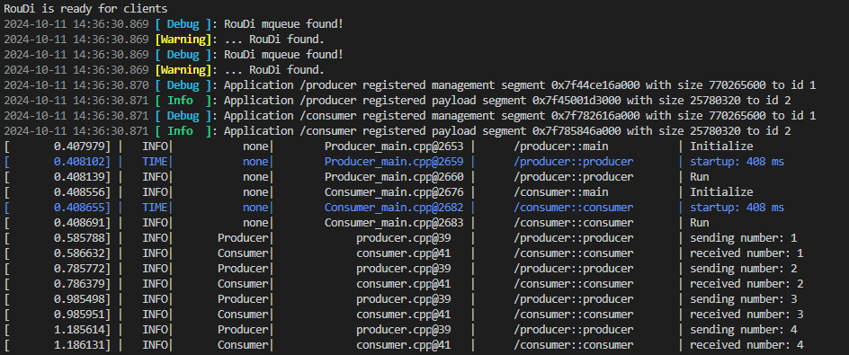
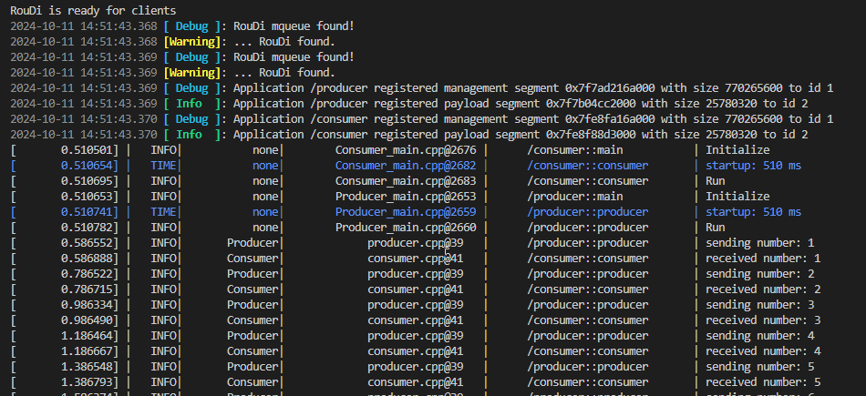

## Run

In this section, we will run the application on a development x86 machine. 

There are two methods to run your application:

1. Using a start script.
2. Using ESME (Execution and State Manager).

### Method 1: Run with Start Script

The start script is automatically created in the build step.

1. Navigate to the Build Directory

    Open a terminal and navigate to the build directory.

    ```
    cd build 
    ```

2. Execute the Start Script

    Run the necessary processes of your application using the start script.

    ```
    sh yaaac_codegen/deploy/carma_0_22/roudi/start_scripts/start_roudi.sh
    ```

Running application launched with start script:


The application can be stoped by pressing `ctrl-c`in the terminal.

### Method 2: Run with ESME

ESME is a daemon responsible for managing processes of the application. It uses a manifest file to configure and manage the processes.

1. Navigate to the Build Directory

    Open a terminal and navigate to the build directory.

    ```
    cd build 
    ```

2. Locate the Manifest File

    An example manifest file is automatically generated in the build directory at `yaaac_codegen/deploy/carma_0_22/roudi/esme`.

3. Run ESME

    Execute the following command to run ESME with the manifest file.

    ```
    ./bin/esme yaaac_codegen/deploy/carma_0_22/roudi/esme/esme_manifest_roudi.json -2 
    ```

With the option -2, the first rungroup specified in the manifest file is automatically started.

Running application launched with ESME:


ESME can be stoped by pressing `ctrl-c`in the terminal.

### Expected Outcome

- Start Script: The application processes should start running, and you should see relevant logs in the terminal.
- ESME: ESME should start managing the application processes as specified in the manifest file.

### Tips

- Ensure that the build was successful before attempting to run the application.
- Use the start script for quick testing and ESME for a more robust and secure management of your application.

Now that we have run the application, let's move on to recording data from the running application.

Previous section: [Visualize](5-visualize.md) | Next section: [Record](7-record.md)