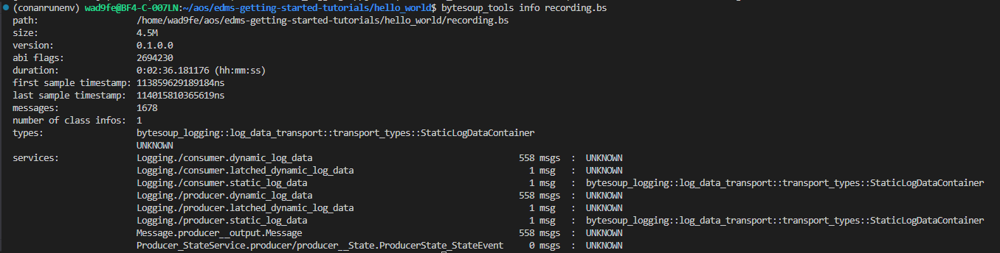

## Measure & Record

In this section, we will measure and record data from the running application on the development machine. This is useful for debugging during the development phase, especially when the application is not running on a real target.

### Prerequisites

- The option `LOGGING_FRAMEWORK` in the `conanfile.py` must be set to `console_and_mta`.

### Steps to record data

1. Build the application for x86 target

    Ensure the application is built for the x86 target as described in the **[Build](4-build.md)** section.

2. Run the application

    Start the application as described in the **[Run](6-run.md)** section.

3. Start the MTA RAW gateway

    Open a new terminal, source the environment and start the MTA RAW Gateway.

    ```
    source ./install/activate_run.sh
    ```

    ```
    mta_raw_output_gateway -f recording.bs
    ```

Recording with MTA RAW Gateway:


4. Stop recording

    Once you have recorded enough data, stop the recording by pressing Ctrl+C.


### Inspect the recorded file with bytesoup tools

>**Note:** If you reuse the terminal used for MTA recording, you don't need to source the environment. Otherwise you have to source `./install/activate_run.sh` before.

1. Index the recorded data

    ```
    bytesoup_tools index recording.bs
    ```

2. Get information about the recorded data (optional)

    ```
    bytesoup_tools info recording.bs
    ```

Using bytesoup_tools for getting information about the recorded data:


### Expected Outcome

- Recording: The recording.bytesoup file should be created with the recorded data.
- Inspection: You should be able to index and get information about the recorded data using Bytesoup tools.

### Tips

- Ensure that the application is running correctly before starting the recording.
- Regularly inspect the recorded data to ensure it contains the expected information.

Now that we have recorded the data, let's move on to analyzing the recorded data.

Previous section: [Run](6-run.md) | Next section: [Analyze](8-analyze.md)
