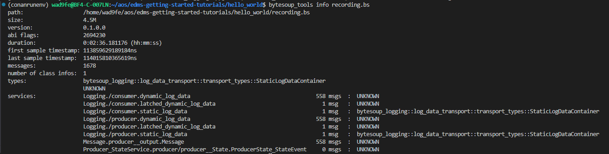
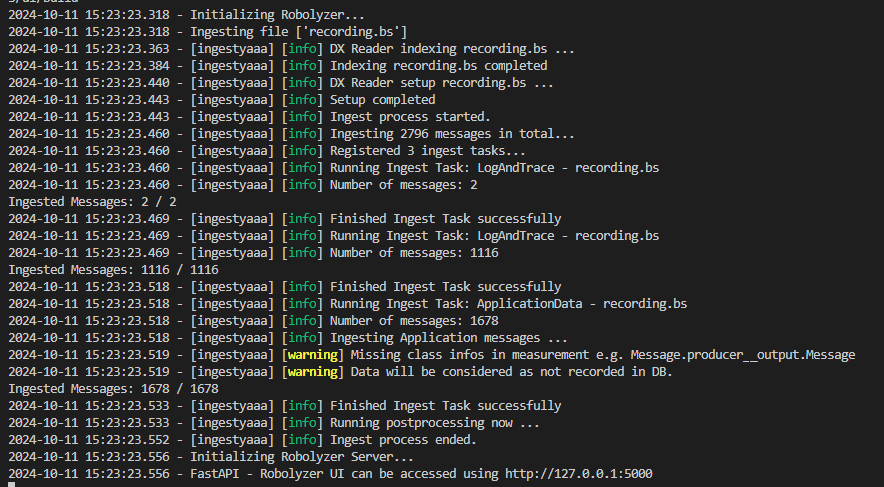
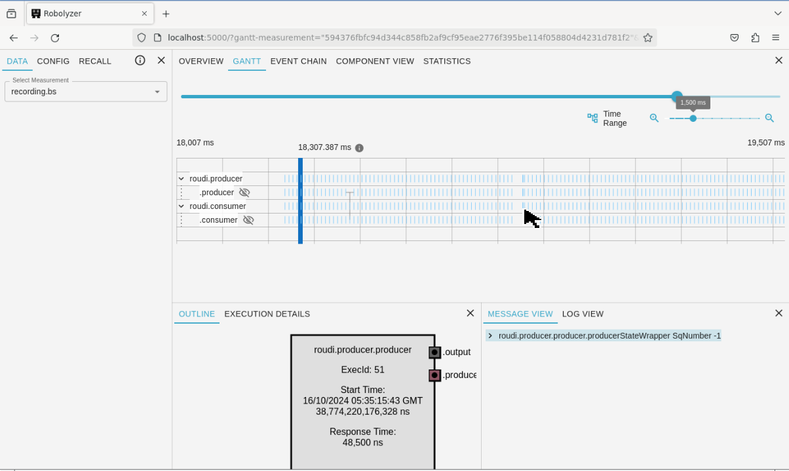

## Analyze

In this section, we will analyze the recorded Bytesoup data using the tool Robolyzer. <a href="https://edms.etas.com/explanations/robolyzer.html" target="_blank">Robolyzer</a> is an analysis tool for recorded FlowTracing information, enabling developers and architects to analyze the execution behavior and data flow in an application.

### Steps to analyze data

>**Note:** For all following steps you have to source the run environment. You have to do this for every new terminal.

```
source ./install/activate_run.sh
```

1. Record data

    Ensure you have recorded data as described in the **[Record](7-record.md)** section.

2. Index the Bytesoup Data (optional)

    >**Note:** If you have already indexed the data, you don't have to do this again.

    Use the Bytesoup tools to index the recorded data.

    ```
    bytesoup_tools index recording.bs 
    ```

3. Get information about the recorded data (optional)

    Retrieve detailed information about the contents of the Bytesoup file.

    ```
    bytesoup_tools info recording.bs
    ```
    Using bytesoup_tools for getting information about the recorded data:
    

4. Create the Robolyzer Model

    Generate a model for analysis with Robolyzer.

    ```
    robolyzer recording.bs
    ```

    Create Robolyzer Model:
    

4. Start Robolyzer Webview

    Open Robolyzer in your web browser to begin analysis.

    ```
    firefox on http://localhost:5000 
    ```

    In Robolyzer, you can analyze the execution behavior of the application in the Gantt chart. Here, you can see when activities have been started and how they have been executed. You can expand the activities to see the execution of the runnables inside. When selecting an activity or runnable, you can see the data dependency between the executables. This reflects the actual communication between the Producer runnable and the Consumer runnable. 

    Robolyzer Webview:
    

### Expected Outcome

- Indexing: The Bytesoup data should be indexed successfully.
- Information Retrieval: You should be able to get detailed information about the recorded data.
- Robolyzer Model: A model should be created for analysis.
- Robolyzer Webview: Robolyzer should open in your web browser, displaying the analyzed data.

### Tips

- Ensure that the recorded data is complete and accurate before starting the analysis.
- Regularly use Robolyzer to analyze different aspects of your application to identify potential issues.

For further information about Robolyzer, refer to the Robolyzer User Manual. 

Now that we have analyzed the data, let's move on to recomputing and debugging the business logic. We will also see how Robolyzer can be used for debugging purposes. 

Previous section: [Record](7-record.md) | Next section: [Recompute and Debug](9-recompute.md)