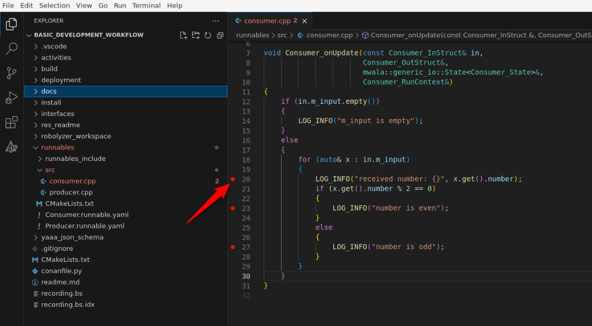

## Recompute and Debug

Recompute is a task in which recorded or artificially generated data is provided to a system, such as ETAS Deterministic Middleware Solution applications, and where the behavior of the system is then reproduced for analysis and reporting purposes.

In this section, we will replay the previously recorded Bytesoup data and debug the business logic within Visual Studio Code. For this, we will use the 
<a href="https://edms.etas.com/explanations/recall.html" target="_blank">Recall player</a>, a simulator tool of SDK designed to be used in the context of open loop and closed loop application. Furthermore, we will use <a href="https://edms.etas.com/explanations/robolyzer.html" target="_blank">Robolyzer</a> as it also supports the debugging use case.

For more information on recompute, please refer to the 
<a href="https://edms.etas.com/explanations/recompute.html" target="_blank">knowledge article on recompute</a>.

### Prerequisites

- The option `RECALL` in the `conanfile.py` must be set to `ON`.
- The application must be built for the x86 target as described in the **[Build](4-build.md)** section.
- A Bytesoup file must be recorded as described in the **[Record](7-record.md)** section.

### Steps to recompute and debug

1. Start the DOL Player Rest Server (in a separate terminal)

    Source the environment and start the DOL Player Rest Server.

    ```
    source ./install/activate_run.sh
    ```
    
    ```
    sudo ldconfig $(pwd)/build/lib/
    ```

    ```
    dol_player_rest_server -l3 --port 5001 &
    ```

<!--
> ***TODO:*** Add a screenshot.
-->

2. Set a breakpoint in your business logic

    - Open your business logic code in Visual Studio Code.
    - Set a breakpoint at the desired location in your C++ code.

    

3. Start Robolyzer server (in a separate terminal)

    Source the environment and start the Robolyzer server with the recorded Bytesoup file.

    ```
    source ./install/activate_run.sh & robolyzer recording.bs
    ```

4. Start Robolyzer Webview

    Open Robolyzer in your web browser to begin the replay process.

    ```
    start firefox on http://localhost:5000
    ```

5. Select Runnable to replay in the Robolyzer Gantt chart

    In the Robolyzer webview, select the runnable you want to replay from the Gantt chart.

    

6. Start Recall Player in Visual Studio Code

    Open the Command Palette with Ctrl+Shift+P and type Recall Player.

    

    Start the Recall Player and wait for it to connect. Start Recall Player in Visual Studio Code. Start Recall Player waits for connection.

    

7. Connect Robolyzer to Recall Player

    In the Robolyzer webview, connect to the Recall Player and start the recompute process. Connect Robolyzer to Recall Player and Start Recompute.

    

8. Debug in Visual Studio Code

Once connected, the Recall Player will replay the recorded data, and the breakpoint should be hit in Visual Studio Code.


<!--
> ***TODO:*** Check if an animated GIF can be used.
-->

Congratulations! You have successfully recomputed and debugged your first business logic with Robolyzer and GDB in VS Code! 🎉 

<!--
### Expected Outcome

- DOL Player Rest Server: The server should start and listen on port:5001.
- Robolyzer Server: The server should start and process the recorded Bytesoup file.
- Robolyzer Webview: The webview should display the Gantt chart and allow you to select runnables.
- Recall Player: The Recall Player should connect and replay the data, hitting the breakpoint in Visual Studio Code.
-->

### Tips

- Ensure all prerequisites are met before starting the recompute process.
- Use the Gantt chart in Robolyzer to accurately select the runnable you wish to debug.

Now that we have successfully recomputed and debugged the business logic, you have completed the tutorial!

Previous section: [Analyze](8-analyze.md) | [Back to beginning](../readme.md)
