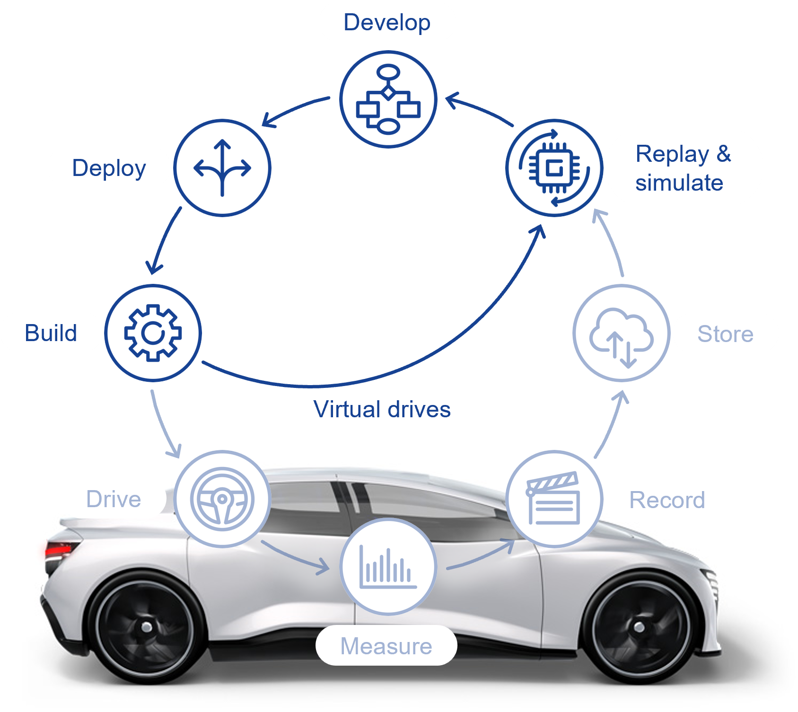
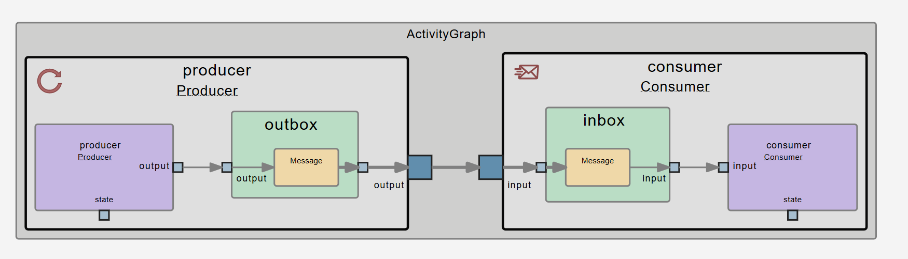

# Basic Development Workflow

This tutorial guides you as an individual developer through the entire development cycle for an application.

## What you will do and achieve

The tutorial is split into multiple following sections that build on each other. Following the tutorial, you will achieve the following:

- **[Develop](docs/2-develop.md)**: Understand the project structure in YAAA (Yaml As an Architecture) and business logic of the application (C++).
- **[Build](docs/4-build.md)**: Compile the application using Conan and CMake.
- **[Visualize](docs/5-visualize.md)**: View the generated architecture model visualization in your browser.
- **[Run](docs/6-run.md)**: Execute the application using either a start script or ESME (Execution and State Manager).
- **[Measure & Record](docs/7-record.md)**: Capture data from the running application and store it in a file.
- **[Analyze](docs/8-analyze.md)**: Analyze the recorded data using <a href="https://edms.etas.com/explanations/robolyzer.html" target="_blank">Robolyzer</a>.
- **[Recompute and Debug](docs/9-recompute.md)**: Replay recorded data with <a href="https://edms.etas.com/explanations/robolyzer.html" target="_blank">Robolyzer</a> and <a href="https://edms.etas.com/explanations/recall.html" target="_blank">Recall player</a>, and debug the business logic (C++ code) in Visual Studio Code.

By the end of this tutorial, you will have developed, built, visualized, run, measured & recorded, analyzed, recomputed and debugged your first application.
Through this, you will have achieved a full roundtrip through the [AD Cycle](https://edms.etas.com/the-ad-cycle-how-it-works.html). 
As part of this, you will also have gotten to know the main tools of the SDK.

## The application

The tutorial is using a simple "Hello World" example, consisting of a Producer and Consumer process.

## Important Notes

- This tutorial description can be used with any other project, but however this project is preconfigured for the specific use cases covered here.
- It complements, but does not replace, the more detailed tutorials available in the **tutorial** folder.
- For a deeper understanding of concepts, refer to the training materials.

Let's get started!

Next section: [Develop](docs/2-develop.md)