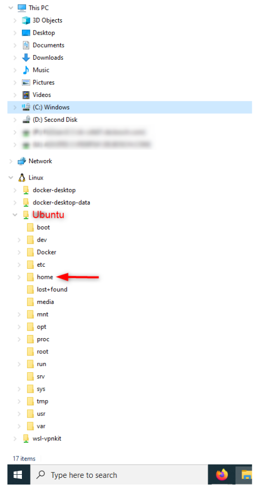
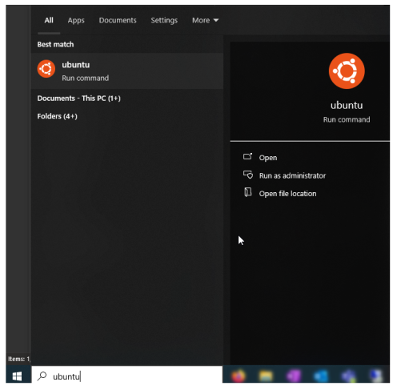
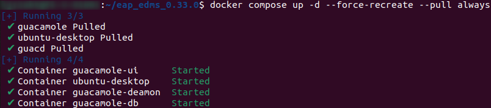
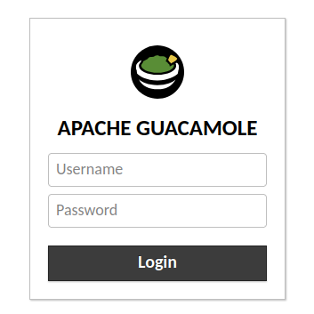

# EDMS Installation Guide for EAP

This guide provides a step-by-step walkthrough for installing EDMS (EAP) on any Linux-Distribution.

## Requirements

Before beginning the installation, ensure your system meets the following requirements:

- **Disk Space**: You should have about 20 GB of disk space available.
  
- **On Windows**:
  - **WSL 2**: Windows Subsystem for Linux 2 (WSL 2) is required. Installation instructions for WSL 2 are publicly available. Please consult your system administrator if needed. [WSL 2 Installation Guide](https://docs.microsoft.com/en-us/windows/wsl/install) --> for Bosch Employees
  - **Docker inside WSL 2**: Depending on the Linux distribution inside WSL 2, Docker should be installed accordingly. Docker provides installation instructions for all major operating system distributions. Please consult your system administrator if needed. [Docker Installation Guide for Linux](https://docs.docker.com/engine/install/) --> for Bosch Employees

- **On Linux**:
  - **Any Linux distribution** (e.g., Ubuntu, CentOS)
  - **Docker**: Docker installation is required. Docker provides installation instructions for all major operating system distributions. Please consult your system administrator if needed. [Docker Installation Guide for Linux](https://docs.docker.com/engine/install/) --> for Bosch Employees

- **RAM**: The system should have a minimum of 8 GB RAM. If using WSL 2, configure your system accordingly. More information on setting RAM for WSL can be found here: [WSL Configuration Guide](https://learn.microsoft.com/en-us/windows/wsl/wsl-config#wslconfig)

- **Internet Connection**: Your computer must have a connection to the Internet. This is required to download additional open-source software packages. For WSL 2 and Docker, you may need proxy configuration specific to your organization.

## Installation of the Early Access Package (EAP) of the EDMS

Follow these steps to install the Early Access Package (EAP) of the EDMS in your environment.

### Windows as Distribution

#### Step 1: Copy the EAP ZIP File to WSL

1. Download the ZIP file containing the EAP to your Windows system.
2. Copy the ZIP file into the WSL subsystem, specifically into the `/home/<your-user>` directory within WSL.

   **Hint**: When downloading the file from the browser, it may not directly appear in the WSL file system. To avoid issues, first download it on your Windows file system and then copy it to the appropriate WSL directory.



#### Step 2: Start the WSL Distribution

1. Open WSL by clicking on the Start button and typing the name of your Linux distribution (e.g., "Ubuntu").



2. Launch the distribution to start a terminal session in WSL.

#### Step 3: Extract the EAP Content in WSL

1. Navigate to the directory where you copied the ZIP file.
2. Use the command line in WSL to extract the contents of the EAP package.

   **Note**: Only extract using the command line and **do not** use the 7z GUI for this step.

   Run the following command to extract the EAP package:

```bash
tar xzvf eap_edms_<version>.tar.gz
```

Replace <version> with the actual version number of the EAP package.

### Linux as Distribution

#### Step 1: Copy the EAP ZIP File to your home Directory

1. Download the ZIP file containing the EAP.
2. Copy the ZIP file into the home directory `/home/<your-user>` of your linux system.

#### Step 2: Extract the EAP Content

1. Navigate to the directory where you copied the ZIP file.
2. Use the command line to extract the contents of the EAP package.

   **Note**: Only extract using the command line and **do not** use the 7z GUI for this step.

   Run the following command to extract the EAP package:

```bash
tar xzvf eap_edms_<version>.tar.gz
```

Replace <version> with the actual version number of the EAP package.

## Get the EAP started

After successfully installing the Early Access Package (EAP), you can start working with it. To run the EAP, you need to launch the Docker containers as described below.

### Step 1: Starting the EAP Docker Containers

1. **Navigate to the EAP directory**: Open a terminal in WSL and navigate to the `eap_edms_<version>` folder where the EAP files are located.

```bash
cd eap_edms_<version>
```

2. **Start the Docker containers**: Run the following command to start the Docker containers for the EAP:

```bash
docker compose up -d --force-recreate --pull always
```

This command pulls the required Docker images and builds the containers. Once the process is complete, you should see four running containers: **ubuntu-desktop**, **guacamole-daemon**, **guacamole-db** and **guacamole-ui**, each showing a "started" status.



**Note**: Starting the Docker containers for the first time may take some time.

### Step 2: Accessing the EAP Interface

The EAP is served via Apache Guacamole, a remote desktop gateway. Once the Docker containers are running, you can access the EAP interface by following these steps:

1. **Open your web browser** and enter the following URL:

```bash
http://localhost:8081/guacamole/#/
```



2. **Login to the EAP**: In your browser, you should see the login screen. Use the following credentials to log in:

- **Username**: `eapuser`
- **Password**: `etas`

3. **Access the Linux Desktop**: After a successful login, you should see a Linux desktop environment with several desktop icons in your browser.


This is the EAP environment, and you are now ready to start using it.
