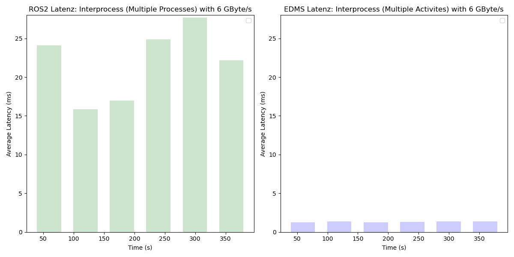
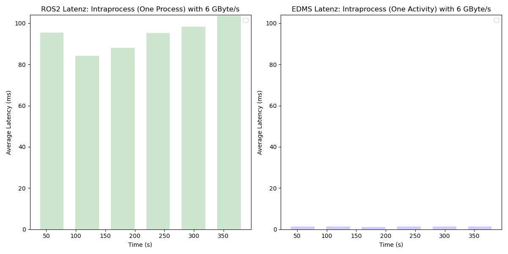
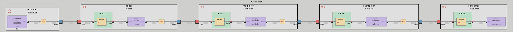
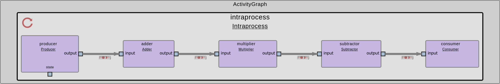

# Communication Latency Differences between Interprocess- and Intraprocess-Communication

In this tutorial you will get instructions to set up an interprocess-communication- and intraprocess-communication-model (a simple model sending numbers and forwarding them each second) in ROS 2 as well as in EDMS.

To compare ROS 2 and EDMS, we use the same base structure of Process-Communication from [Tutorial 3](../Process_Communication/README.md) with some slightly variations. Therefore we've created a message of the size 40 MB to forward between the processes or single process. In the following you will get a better overview for the setup in ROS 2 and EDMS as well as a comparison between the two alternatives.

The following visualizations show the comparison between ROS 2 and EDMS regarding a 6 GBit/s workload for Inter- and Intraprocess Communication.




## ROS 2 Communication Latency: Interprocess vs Intraprocess Communication

The [ROS 2-repository](Communication_Latency_ROS2/) demonstrates the latency of forwarding huge messages within the interprocess- as well as the intraprocess-communication:

- **Interprocess Communication:** Separate processes for publishing, forwarding and subscribing.


- **Intraprocess Communication:** A single process combining publishing, forwarding and subscribing functionalities.


Therefore every second the 40 MB message gets published and forwarded. Over this communication-process we collect the Latency and calculate the average every minute to publish it in the terminal.

### How to Run

#### Building the Code

You have to clone the repository into a workspace of your choice:

```bash
mkdir -p ~/workspace
cd ~/workspace
git clone https://github.boschdevcloud.com/ETAS-EDMS/ros2edms.git
```

Then for building the relevant package for this tutorial run the following commands:

```bash
cd ros2edms/tutorials/Communication_Latency/Communication_Latency_ROS2
colcon build
source install/setup.bash
```

#### Running Interprocess Communication Model

Start the launch-file to start all processes:

```bash
ros2 launch interprocess_chain interprocess_launch.py
```

#### Running Intraprocess Communication Model

Run the single process:

```bash
ros2 run intraprocess_chain intraprocess_chain
```

---

### Results

To have an example for the existing latencies over time as a comparison we have some results for the [interprocess-communication](Communication_Latency_ROS2/Results_ROS2_interprocess.txt) and the [intraprocess-communication](Communication_Latency_ROS2/Results_ROS2_intraprocess.txt) over time.

---

## EDMS Communication Latency: Interprocess vs Intraprocess Communication

The [EDMS-repository](Communication_Latency_EDMS/) demonstrates the latency of forwarding huge messages within the interprocess- as well as the intraprocess-communication:

- **Interprocess Communication:** Separate processes for publishing, forwarding and subscribing.



- **Intraprocess Communication:** A single process combining publishing, forwarding and subscribing functionalities.



### How to Run

#### Building the Code

You have to clone the repository into a workspace of your choice:

```bash
mkdir -p ~/workspace
cd ~/workspace
git clone https://github.boschdevcloud.com/ETAS-EDMS/ros2edms.git
```

Then for building the relevant package for this tutorial run the following commands:

```bash
cd ros2edms/tutorials/Communication_Latency/Communication_Latency_EDMS
conan install -if install -pr:b x86_64_linux_gcc8_debug -pr:h x86_64_linux_gcc8_debug $(pwd)
conan build if install -bf build $(pwd)
```

### Running Interprocess Communication Model

Start the Interprocess Communication Model:

```bash
cd build
esme yaaac_codegen/deploy/noviroc/mw_1_separate/esme/esme_manifest_mw_1_separate.json -1
```

### Running Intraprocess Communication Model

Start the Intraprocess Communication Model:

```bash
cd build
esme yaaac_codegen/deploy/noviroc/mw_1_combined/esme/esme_manifest_mw_1_combined.json -1
```

---

### Results

To have an example for the existing latencies over time as a comparison we have some results for the [interprocess-communication](Communication_Latency_EDMS/Results_EDMS_interprocess.txt) and the [intraprocess-communication](Communication_Latency_EDMS/Results_EDMS_intraprocess.txt) over time.

---

## Comparison between the Results of EDMS and ROS 2

As we compare the results of interprocess and intraprocess communication for EDMS and ROS 2, the main difference becomes apparent quickly. The average latency in EDMS is significantly lower than in ROS 2. Furthermore, when comparing the results of interprocess and intraprocess communication from [Tutorial 3](../Process_Communication/README.md) and [Tutorial 4](README.md), we can observe that ROS 2 exhibits increasing latency as the message size grows, even though the communication model remains the same. In contrast, the latency in EDMS remains constant across both communication models when comparing the results from [Tutorial 3](../Process_Communication/README.md) and [Tutorial 4](README.md) as in the following examples.

### Examples

**Latency Tutorial 3 interprocess-communication ROS 2 vs. Latency Tutorial 4 interprocess-communication ROS 2**:

Tutorial 3:

```bash
[INFO] [subscriber_node]: Average latency over the last 60 samples: 0.89 ms
[INFO] [subscriber_node]: Average latency over the last 60 samples: 1.02 ms
[INFO] [subscriber_node]: Average latency over the last 60 samples: 0.75 ms
[INFO] [subscriber_node]: Average latency over the last 60 samples: 1.13 ms
[INFO] [subscriber_node]: Average latency over the last 60 samples: 1.31 ms
[INFO] [subscriber_node]: Average latency over the last 60 samples: 0.79 ms
```

Tutorial 4:

```bash
[subscriber-5] [INFO] [subscriber_node]: Average latency over last 60 samples: 24.12 ms
[subscriber-5] [INFO] [subscriber_node]: Average latency over last 60 samples: 15.83 ms
[subscriber-5] [INFO] [subscriber_node]: Average latency over last 60 samples: 16.94 ms
[subscriber-5] [INFO] [subscriber_node]: Average latency over last 60 samples: 24.86 ms
[subscriber-5] [INFO] [subscriber_node]: Average latency over last 60 samples: 27.67 ms
[subscriber-5] [INFO] [subscriber_node]: Average latency over last 60 samples: 22.18 ms
```

**Latency Tutorial 3 interprocess-communication EDMS vs. Latency Tutorial 4 interprocess-communication EDMS**:

Tutorial 3:

```bash
[59.438241] | INFO | Consumer | consumer.cpp@39 | consumer::consumer | Average latency over last 60 samples: 1.28 ms
[119.436572] | INFO | Consumer | consumer.cpp@39 | consumer::consumer | Average latency over last 60 samples: 1.37 ms
[179.437774] | INFO | Consumer | consumer.cpp@39 | consumer::consumer | Average latency over last 60 samples: 1.26 ms
[239.436128] | INFO | Consumer | consumer.cpp@39 | consumer::consumer | Average latency over last 60 samples: 1.30 ms
[299.436029] | INFO | Consumer | consumer.cpp@39 | consumer::consumer | Average latency over last 60 samples: 1.36 ms
[359.436250] | INFO | Consumer | consumer.cpp@39 | consumer::consumer | Average latency over last 60 samples: 1.35 ms
```

Tutorial 4:

```bash
[59.438241] | INFO | Consumer | consumer.cpp@39 | consumer::consumer | Average latency over last 60 samples: 1.28 ms
[119.436572] | INFO | Consumer | consumer.cpp@39 | consumer::consumer | Average latency over last 60 samples: 1.37 ms
[179.437774] | INFO | Consumer | consumer.cpp@39 | consumer::consumer | Average latency over last 60 samples: 1.26 ms
[239.436128] | INFO | Consumer | consumer.cpp@39 | consumer::consumer | Average latency over last 60 samples: 1.30 ms
[299.436029] | INFO | Consumer | consumer.cpp@39 | consumer::consumer | Average latency over last 60 samples: 1.36 ms
[359.436250] | INFO | Consumer | consumer.cpp@39 | consumer::consumer | Average latency over last 60 samples: 1.35 ms
```

---

## Conclusion

The observed differences in latency between interprocess and intraprocess communication in ROS 2 and EDMS can be attributed to their underlying communication mechanisms. In ROS 2, messages exchanged between processes are transmitted as complete data blocks, requiring serialization, inter-process data transfer, and deserialization. This introduces significant overhead, especially as message size increases, leading to higher latency.

In contrast, EDMS utilizes shared memory for interprocess communication, allowing processes to exchange only memory references (pointers) rather than copying entire data structures. As a result, message passing in EDMS remains highly efficient and exhibits minimal latency, even for larger message sizes. This architectural advantage ensures that communication performance remains consistent across different communication models, making EDMS particularly well-suited for applications requiring real-time data exchange with minimal overhead.
