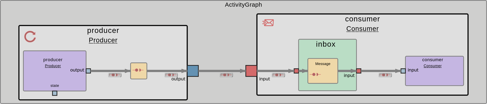

# Build your first Hello World project

This guide provides a step-by-step walkthrough for building a simple "Hello World" project in ROS 2 and EDMS.

## ROS 2:


## EDMS:



## ROS 2 set up and build

After you followed the [Installation](./installation/ROS 2/README.md) guide for ROS 2, you're now ready to create a workspace, download and get started with your first [tutorial-application](https://github.boschdevcloud.com/KJZ2ABT/ROS2_Hello_World) in ROS 2.

### Create Workspace

Before installing you're first application, you have to create a Workspace to provide a structured build and development environment to efficiently manage, compile, and organize multiple ROS 2 applications while handling dependencies and enabling modularity.

```bash
mkdir -p ~/workspace
cd ~/workspace
```

### Download Tutorial and build it

Now you're ready to create your own applications or get started with the first tutorial application. Therefore clone the current repository into your **workspace**-folder:

```bash
git clone https://github.boschdevcloud.com/ETAS-EDMS/ros2edms.git
```

After creating the Workspace and copy the first tutorial successfully you can build the environment by running the following commands:

```bash
cd ~/workspace/ros2edms/tutorials/Hello_World/Hello_World_ROS2
colcon build
```

To finally use your application you have to source your **install**-folder before starting the application. Therefore run the command:

```bash
source install/setup.bash
```

If you want to make it permanent for every terminal modify your **.bashrc**-file:

```bash
nano ~/.bashrc
```

By adding the following line:

```bash
source ~/workspace/ros2edms/tutorials/Hello_World/Hello_World_ROS2/install/setup.bash
```

Now save the modified **.bashrc** by pressing **Ctrl + O** and **Enter**. Than press **Ctrl + X** to exit nano.

### Start the Tutorial

The next step would be to open 2 terminals next to each other and run this command to start your Producer in one Terminal:

```bash
ros2 run hello_world publisher
```

In the other Terminal you should run this command to start your Consumer:

```bash
ros2 run hello_world subscriber
```

Congratulations! You've successfully started you're first tutorial-application in ROS 2 by generating a simple Hello World Project.

## EDMS set up and build

After you followed the [Installation](./installation/EDMS/README.md) guide for EDMS, you're now ready to download and get started with your first [tutorial-application](https://github.boschdevcloud.com/KJZ2ABT/EDMS_Producer_Consumer) in EDMS.

### Download Tutorial and build it

At first you have to clone the whole [repository](https://github.boschdevcloud.com/ETAS-EDMS/tree/main) into your **home**-directory of the ubuntu-desktop which you should have started with guacamole. If you need help to start it just refer to the [Installation](./installation/EDMS/README.md) of EDMS. Before cloning, still create a workspace to work in to get a comparable structure to a workspace for ROS 2. Therefore run the following commands:

```bash
mkdir -p ~/workspace
cd ~/workspace
git clone https://github.boschdevcloud.com/ETAS-EDMS/ros2edms.git
```

After creating the Workspace and copy the first tutorial successfully you can install the missing dependencies for your application and build-environment by running the following commands:

```bash
cd ~/workspace/ros2edms/tutorials/Hello_World/Hello_World_EDMS
conan install . -if=install
```

After successfully install all needed dependencies you can build the whole environment and application with the command:

```bash
conan build . -bf=build -if=install
```

Now you successfully build you're first application. Follow the next steps to get it running.

### Start the Tutorial

The next step would be to navigate into the **build**-folder and run a start script to run the tutorial-application:

```bash
cd ~/workspace/ros2edms/tutorials/Hello_World/Hello_World_EDMS/build
sh yaaac_codegen/deploy/carma_0_22/roudi/start_scripts/start_roudi.sh
```

Congratulations! You've successfully started you're first tutorial-application in EDMS by generating a simple Producer and Consumer communicating with each other.
