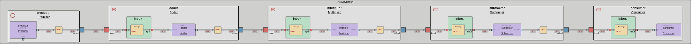
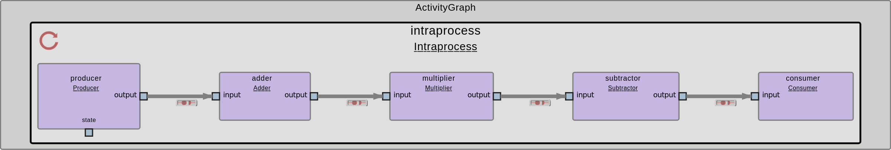
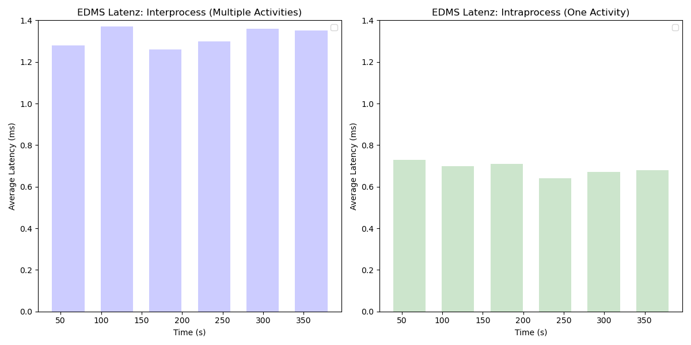

# EDMS Process Chain: Interprocess vs Intraprocess Communication

This repository demonstrates two approaches to implementing a process chain within EDMS:

- **Interprocess Communication:** Separate activities for sending, changing and receiving messages.



- **Intraprocess Communication:** A single activity combining sending, changing and receiving functionalities.



The following Visualization shows the Latency comparison between the 2 approaches:



## Files Overview

### 1. `producer.cpp`

- **Description:** Publishes an incrementing integer and the current system time at regular intervals of 1 second.
- **Purpose:** Acts as the source, sending an increasing integer and a timestamp for further processing by other activities.
- **Usage:** To be used in combination with `adder.cpp`, `multiplier.cpp`, and `subtractor.cpp`, where the published integer is processed and forwarded across multiple activities.

### 2. `adder.cpp`

- **Description:** Receives the published integer and timestamp from `publisher.cpp`, processes the integer by adding 10 to it, and forwards it to the next activity.
- **Purpose:** This activity modifies the data received from `publisher.cpp` by adding 10 to the received integer and forwarding both the modified integer and the timestamp.
- **Usage:** To be used in combination with `multiplier.cpp`, where the processed integer will be further transformed.

### 3. `multiplier.cpp`

- **Description:** Receives the published integer and timestamp from `adder.cpp`, processes the integer by multiplying it by 2, and forwards the result to the next activity.
- **Purpose:** This node processes the data received from `adder.cpp` by doubling the integer and forwarding both the processed integer and timestamp to `subtractor.cpp`.
- **Usage:** To be used in combination with `subtractor.cpp`, where the final integer is modified once again.

### 4. `subtractor.cpp`

- **Description:** Receives the published integer and timestamp from `multiplier.cpp`, processes the integer by subtracting 5 from it, and publishes the final result to `final_value_topic` and `final_time_topic`.
- **Purpose:** The final processing step, where the integer received from `multiplier.cpp` is reduced by 5, and both the integer and timestamp are forwarded to `consumer.cpp`.
- **Usage:** To be used with `consumer.cpp`, where the final value and timestamp are received, and the latency is measured.

### 5. `consumer.cpp`

- **Description:** Receives the published integer and timestamp from `subtractor.cpp` and calculates the latency between receiving the timestamp and the current time.
- **Purpose:** Acts as the final node in the chain, receiving the processed data, calculating the round-trip latency for the timestamp, and reporting the average latency over the last 60 samples.
- **Usage:** To be used in combination with `publisher.cpp`, `adder.cpp`, `multiplier.cpp`, and `subtractor.cpp`, where it calculates the latency for the messages being passed along the chain.

---

## Key Differences

| Feature                 | Interprocess Communication                                                  | Intraprocess Communication                |
| ----------------------- | --------------------------------------------------------------------------- | ----------------------------------------- |
| **Activity Separation** | Separate activities for different processes.                                | Single activity for different runnables.  |
| **Message Latency**     | Slightly higher due to a higher number of processes and pointer forwarding. | Lower due to one big process.             |
| **Flexibility**         | Modular design for distributed systems.                                     | Compact design, easier to manage locally. |

---

## How to Run

### Building the Code

You have to clone the repository into a workspace of your choice:

```bash
mkdir -p ~/workspace
cd ~/workspace
git clone https://github.boschdevcloud.com/ETAS-EDMS/ros2edms.git
```

Then for building the relevant package for this tutorial run the following commands:

```bash
cd ros2edms/tutorials/Process_Communication/Process_Communication_EDMS
conan install -if install -pr:b x86_64_linux_gcc8_debug -pr:h x86_64_linux_gcc8_debug $(pwd)
conan build if install -bf build $(pwd)
```

### Running Interprocess Communication Model

Start the Interprocess Communication Model:

```bash
cd build
esme yaaac_codegen/deploy/noviroc/mw_1_separate/esme/esme_manifest_mw_1_separate.json -1
```

### Running Intraprocess Communication Model

Start the Intraprocess Communication Model:

```bash
cd build
esme yaaac_codegen/deploy/noviroc/mw_1_combined/esme/esme_manifest_mw_1_combined.json -1
```

---

### Explanation of Differences

1. **Latency**:

   - **Intraprocess Communication** shows significantly lower latencies due to the direct memory access between components within the same process. The message data is not copied between processes, leading to faster execution times.
   - **Interprocess Communication**, while modular, has slightly higher latencies because of the overhead from process boundaries and message forwarding between processes.

2. **Results Comparison**:
   The average latency for the last 60 samples from both models clearly shows the performance benefits of intraprocess communication:

   **Interprocess Communication:**

   - Average latency: 1.28 ms to 1.36 ms

   **Intraprocess Communication:**

   - Average latency: 0.64 ms to 0.73 ms

   This data shows that intraprocess communication can significantly reduce message latency, making it more suitable for high-performance applications where low-latency processing is critical.

3. **Conclusion**:
   **Intraprocess communication** is more efficient for high-performance, single-activity setups, offering reduced latency and better performance. On the other hand, **interprocess communication** provides modularity and scalability, making it ideal for distributed systems where different activities can run in parallel or on separate machines.

To have an example for existing latencies over time as a comparison we have some results for the [interprocess-communication](Results_EDMS_interprocess.txt) and the [intraprocess-communication](Results_EDMS_intraprocess.txt).
