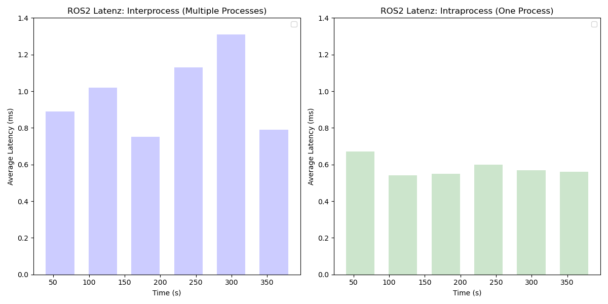

# ROS 2 Process Chain: Interprocess vs Intraprocess Communication

This repository demonstrates two approaches to implementing a process chain with three callbacks in ROS 2:

- **Interprocess Communication:** Separate processes for publishing, forwarding and subscribing.


- **Intraprocess Communication:** A single process combining publishing, forwarding and subscribing functionalities.


The following Visualization shows the Latency comparison between the 2 approaches:



## Files Overview

### 1. `publisher.cpp`

- **Description:** Publishes an incrementing integer and the current system time at regular intervals to the `value_topic` and `time_topic` respectively.
- **Purpose:** Acts as the source node, sending an increasing integer (`value_topic`) and a timestamp (`time_topic`) for further processing by subscriber nodes.
- **Usage:** To be used in combination with `callback1_node.cpp`, `callback2_node.cpp`, and `callback3_node.cpp`, where the published integer is processed and forwarded across multiple nodes.

### 2. `callback1_node.cpp`

- **Description:** Subscribes to `value_topic` and `time_topic`, processes the integer by adding 10 to it, and forwards it to `value_topic1` and `time_topic1`.
- **Purpose:** This node modifies the data received from `publisher.cpp` by adding 10 to the received integer and forwarding both the modified integer and the timestamp.
- **Usage:** To be used in combination with `callback2_node.cpp`, where the processed integer will be further transformed.

### 3. `callback2_node.cpp`

- **Description:** Subscribes to `value_topic1` and `time_topic1`, processes the integer by multiplying it by 2, and forwards the result to `value_topic2` and `time_topic2`.
- **Purpose:** This node processes the data received from `callback1_node.cpp` by doubling the integer and forwarding both the processed integer and timestamp to `callback3_node.cpp`.
- **Usage:** To be used in combination with `callback3_node.cpp`, where the final integer is modified once again.

### 4. `callback3_node.cpp`

- **Description:** Subscribes to `value_topic2` and `time_topic2`, processes the integer by subtracting 5 from it, and publishes the final result to `final_value_topic` and `final_time_topic`.
- **Purpose:** The final processing step, where the integer received from `callback2_node.cpp` is reduced by 5, and both the integer and timestamp are forwarded to `subscriber.cpp`.
- **Usage:** To be used with `subscriber.cpp`, where the final value and timestamp are received, and the latency is measured.

### 4. `subscriber.cpp`

- **Description:** Subscribes to `final_value_topic` and `final_time_topic`, receives the processed data, and calculates the latency between receiving the timestamp and the current time.
- **Purpose:** Acts as the final node in the chain, receiving the processed data, calculating the round-trip latency for the timestamp, and reporting the average latency over the last 60 samples.
- **Usage:** To be used in combination with `publisher.cpp`, `callback1_node.cpp`, `callback2_node.cpp`, and `callback3_node.cpp`, where it calculates the latency for the messages being passed along the chain.

### 4. `multiprocess_executor.cpp`

- **Description:** Initializes and starts all the nodes (`PublisherNode`, `Callback1Node`, `Callback2Node`, `Callback3Node`, and `SubscriberNode`) in a single process using a multi-threaded executor.
- **Purpose:** Starts the ROS 2 system, ensuring that all nodes are executed concurrently in a multi-threaded environment, allowing seamless message passing and processing.
- **Usage:** To be used to launch all the nodes in one process for the entire system to run concurrently and process messages.

---

## Key Differences

| Feature             | Interprocess Communication                   | Intraprocess Communication                    |
| ------------------- | -------------------------------------------- | --------------------------------------------- |
| **Node Separation** | Separate nodes for publisher and subscriber. | Single node for publishing and processing.    |
| **Message Latency** | Higher due to inter-node communication.      | Lower, as messages stay within the same node. |
| **Flexibility**     | Modular design for distributed systems.      | Compact design, easier to manage locally.     |

---

## How to Run

### Building the Code

You have to clone the repository into a workspace of your choice:

```bash
mkdir -p ~/workspace
cd ~/workspace
git clone https://github.boschdevcloud.com/ETAS-EDMS/ros2edms.git
```

Then for building the relevant package for this tutorial run the following commands:

```bash
cd ros2edms/tutorials/Process_Communication/Process_Communication_ROS2
colcon build
source install/setup.bash
```

### Running Interprocess Communication Model

Start the launch-file to start all processes:

```bash
ros2 launch interprocess_chain interprocess_launch.py
```

### Running Intraprocess Communication Model

Run the single process:

```bash
ros2 run intraprocess_chain intraprocess_chain
```

---

### Explanation of Differences

1. **Latency**:

   - **Interprocess Communication** has slightly higher latencies due to the overhead of inter-node message transfers. Each message needs to be passed between different processes, causing a slight delay.
   - **Intraprocess Communication**, on the other hand, consistently shows lower latencies as the message is handled within the same node, reducing the overhead significantly.

2. **Results Comparison**:
   The average latency for the last 60 samples from both models clearly shows the performance benefits of intraprocess communication:

   **Interprocess Communication**:

   - Average latency: 0.75 ms to 1.31 ms

   **Intraprocess Communication**:

   - Average latency: 0.54 ms to 0.67 ms

   This data indicates that **intraprocess communication** can significantly reduce message latency, making it more suitable for applications requiring low-latency performance.

3. **Conclusion**:
   - **Intraprocess communication** is more efficient for high-performance, single-node setups, offering reduced latency and better overall performance. It's especially useful when the system operates within a single process.
   - **Interprocess communication** offers modularity and flexibility, making it ideal for distributed systems where activities are separated into different processes or nodes, but it comes with a small cost in terms of latency.

To have an example for existing latencies over time as a comparison we have some results for the [interprocess-communication](Results_ROS2_interprocess.txt) and the [intraprocess-communication](Results_ROS2_intraprocess.txt).
