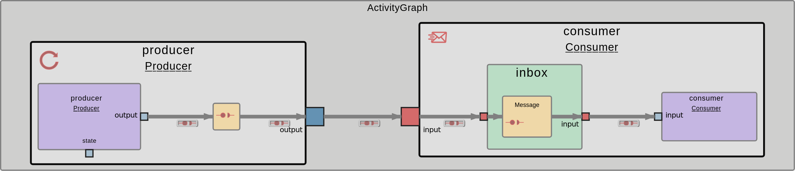

# Set up your first Producer and Consumer application in EDMS

This guide provides a step-by-step walkthrough for creating a simple Producer and Consumer application in EDMS.



## 1. Introduction

Before we dive into creating the producer and consumer application in EDMS, it is essential to understand the concept of the EDMS middleware structure. In EDMS we use `.yaml` files as an object oriented programming language for defining types and instantiating them. For EDMS we use the `.yaml` files to define software related types such as `interfaces`, `runnables` and `activities`. Throughout these files you're able to set up similar applications as in ROS 2, with another structure and implementation.

## 2. Creating the Environment

To start, we need to create an EDMS working area that serves as a structured environment that simplifies the management and development of applications. It ensures modularity, supports efficient builds, and enables seamless integration with different tools. Therefore just simply clone the repository and go to the tutorial folder:

```bash
mkdir -p ~/workspace
cd ~/workspace
git clone https://github.boschdevcloud.com/ETAS-EDMS/ros2edms.git
cd ~/workspace/ros2edms/tutorials/Producer_Consumer/Producer_Consumer_EDMS/
```

### Explanation

**Application Entities**

- **`activities`:** An activity defines a process in an operating system. The user can define the number of threads that can be used to execute runnables.
- **`runnables`:** Defines a task that executes the function and is executed by one of the threads of the activity.
- **`interfaces`:** Defines the interfaces used by the threads, described by their names and corresponding C++ types.

**System Configuration**

- **`deployment`:** Contains the configuration of the and specifies on which nodes in the network the individual activities are executed.
- **`CMakeLists.txt`:** The groupings of these meta-files each contain CMakeLists.txt files that are used to integrate them into the application's build system.
- **`conanfile.py`:** The conanfile.py defines the application’s dependencies and ensures their correct integration. This is essential for completing the build model of this application so that an executable application can be created.

After running the command, a directory structure like this should be accessible:

```bash
Producer_Consumer_EDMS/
├── CMakeLists.txt
├── conanfile.py
├── activities/
│   └── CMakeLists.txt
├── deployment/
│   └── CMakeLists.txt
├── interfaces/
│   ├── interfaces_include/
│   └── CMakeLists.txt
└── runnables/
    ├── runnables_include/
    └── CMakeLists.txt
```

## 3. Setting Up the Producer Node

The producer node publishes messages with a counter appended to the message. In EDMS to set up a Node comparable to ROS 2 you have to set up an own activity and runnable to generate a process with the needed thread, which can be executed. In addition the Producer Node (consisting of activity and runnable) needs an interface to communicate through.

### Producer Activity ([`Producer.activity.yaml`](activities/Producer.activity.yaml))

#### Metadata and Imports

**Code:**

```yaml
yaaa_version: 0.5

imports:
  - Producer.runnable
  - ExampleInterfaces.interfaces

stimulus:
  kind: cyclic
  cycle_ms: 1000
  offset_ms: 0

input_ports: []

output_ports:
  - name: output
    type: Message

runnable_instances:
  - name: producer
    type: Producer

connections:
  inputs: []

  graph: []

  outputs:
    - from: producer.output
      to: output
```

**Explanation:**

- **`yaaa_version`:** Specifies the version of the YAML format being used. This is important for ensuring compatibility with tools or frameworks that parse and process this file.
- **`imports`:** Specifies the external modules or libraries required by this configuration.
- **`*.runnable`:** Imports a specific runnable, a functional block or thread that can be executed.
- **`*.interfaces`:** Imports predefined interfaces, such as data types or communication protocols, used by the activity and the related runnable.
- **`stimulus`:** Defines the execution pattern of the process.
  - **`kind: cyclic`:** Indicates the process (activity) runs cyclically, meaning it executes repeatedly at fixed intervals.
  - **`*cycle_ms: 1000`:** Specifies the cycle time in milliseconds. Here, the process executes every 1000 ms (1 second).
  - **`*offset_ms: 0`:** Specifies the initial delay before the first execution. In this case, there is no offset (execution starts immediately).
- **`input_ports`:** Lists the input ports for receiving data from other components by name and type (refer to `output_ports`).
  - **`[]`:** Indicates this process does not have any input ports or does not consume external data directly.
- **`output_ports`:** Defines the output ports for sending data to other components or processes.
  - **`name`:** Specifies the name of the output port with `output`.
  - **`type`:** Indicates the data type being sent through the output port. Here, the `Message` type is defined in the imported `ExampleInterfaces.interfaces`.
- **`runnable_instances`:** Lists the runnable instances, which are the executable threads and tasks within the process (activity).

  - **`name`:** The name assigned to this runnable instance. Here the name of the executable runnable is `producer`.
  - **`type`:** Specifies the runnable's type, defined in the `Producer.runnable` import. This runnable is responsible for producing the output data for the activity `output`.

- **`connections`:** Defines how data flows between components within the process. This is necessary to map all related files in a process with each other.
  - **`inputs`:** Specifies the input connections by `from` and `to` (refer to `outputs`). An empty array means there are no input connections to this process.
  - **`graph`:** A placeholder for internal connections between components within the process. In this case, no internal connections are defined.
  - **`outputs`:** Specifies the output connections by `from` and `to`.
    - **`from: producer.output`:** Indicates the data originates from the `output` port of the `producer` runnable.
    - **`to: output`:** Routes this data to the process’s external `output` port.

---

#### Add Producer Activity to the Build-System

After initializing the activity in the `*.activity.yaml`, we have to add the file and its information to the build-system. Therefore you have to add some lines in the [CMakeLists.txt](activities/CMakeLists.txt) of the [activities](activities)-folder.

**Code:**

```yaml
yaaa_add_activity(
NAME Producer.activity
)
```

**Explanation:**

- **`yaaa_add_activity`:** Specifies the activity file which should be integrated into the build-system of your application.
- **`NAME`:** Specifies the explicit Name of the activity-file without the ending `.yaml`.

---

### Interface for the messages

After Generating the activity you have to implement an interface throughout which the Producer Node later on can communicate and send messages. Therefore we at first have to implement a struct for the message type of the interface.

#### Generate Message instance in ([`message.hpp`](interfaces/interfaces_include/message.hpp))

Copy the following code into the [`message.hpp`](interfaces/interfaces_include/message.hpp) file:

**Code:**

```cpp
#pragma once

namespace consumer_producer_example
{

struct Message
{
    int number{-1};
};

} // namespace consumer_producer_example
```

**Explanation:**

- **Namespace:** The `consumer_producer_example` namespace encapsulates the `Message` struct to avoid naming conflicts in larger projects.
- **Struct Definition:** The `struct Message` acts as a lightweight container for data exchanged between producers and consumers. The `number` field represents the core data being produced and consumed.
- **Default Initialization:** `int number{-1};` provides a default value for the `number` field, ensuring predictable behavior when a `Message` instance is created but not explicitly populated.

---

#### Generate Interface in ([`ExampleInterfaces.interfaces.yaml`](interfaces/ExampleInterfaces.interfaces.yaml))

To map the interface into the system, copy the following code into the [`ExampleInterfaces.interfaces.yaml`](interfaces/ExampleInterfaces.interfaces.yaml) file:

**Code:**

```yaml
yaaa_version: 0.5

interfaces:
  - type_name: Message
    cpp_type: consumer_producer_example::Message
    cpp_include: message.hpp
```

**Explanation:**

- **`yaaa_version: 0.5`:** Specifies the version of the YAML-based configuration format being used.
- **`interfaces`:** Declares a list of interfaces, with each entry describing an interface used within the system.
- **`type_name`:** Specifies the logical name of the interface, `Message`, which is aligned with the struct name in `message.hpp`.
- **`cpp_type`:** Maps the logical `Message` interface to its corresponding C++ type, `consumer_producer_example::Message`. This links the interface to the specific implementation defined in the `consumer_producer_example` namespace within `message.hpp`.
- **`cpp_include`:** Specifies the file path, `message.hpp`, to include the necessary header file where the `Message` struct is defined. This ensures the struct is available for use wherever the interface is needed.

---

#### Add Interface and Message instance to the Build-System

After initializing the interface in the `*.interface.yaml`, we have to add the file and its information, as well as the `message.hpp`-file to the build-system. Therefore you have to add some lines in the [CMakeLists.txt](interfaces/CMakeLists.txt) of the [interfaces](interfaces)-folder:

**Code:**

```yaml
yaaa_add_interface(
NAME ExampleInterfaces.interfaces
CPP_INCLUDE_DIRS interfaces_include
)
```

**Explanation:**

- **`yaaa_add_interface`:** It integrates the interface into the build-system, to make it available for inclusion and mapping.
- **`NAME ExampleInterfaces.interfaces`:** Assigns the name `ExampleInterfaces.interfaces` to this set of interfaces. This refers to the `*.interfaces.yaml`-file in which the interface is set up.
- **`CPP_INCLUDE_DIRS interfaces_include`:** Specifies the directory, `interfaces_include`, where the C++-header-files (containing the data types of the interface) of the interfaces are located.

### Producer Runnable ([`Producer.runnable.yaml`](runnables/Producer.runnable.yaml))

After generating the activity and interface instances the last thing missing to set up for the Producer Node in EDMS is the runnable (thread) for the Producer activity (process). Therefore we start by mapping the runnable in the yaml-environment, by adding the code into the [`Producer.runnable.yaml`](runnables/Producer.runnable.yaml):

**Code:**

```yaml
yaaa_version: 0.5

imports:
  - ExampleInterfaces.interfaces

input_ports: []

output_ports:
  - name: output
    type: Message

internal_state:
  cpp_type: example::InternalState
  cpp_include: internal_state.hpp
```

**Explanation:**

- **`yaaa_version: 0.5`:** Specifies the version of the YAML-based configuration format being used.
- **`imports`:** Lists external interface definitions that this configuration relies on. `ExampleInterfaces.interfaces` refers to the previously defined set of interfaces which includes the `Message` interface.
- **`input_ports`:** Defines the input data ports for this runnable. In this configuration, the list is empty, meaning the runnable does not receive any direct inputs from other runnables.
- **`output_ports`:** Specifies the data outputs provided by the runnable.
  - **`name: output`:** Names the output port as `output`.
  - **`type: Message`:** Indicates that the output data type is `Message`, which corresponds to the `Message` struct added in the [`ExampleInterfaces.interfaces`](interfaces/ExampleInterfaces.interfaces.yaml).
- **`internal_state`:** Describes the internal state or data that the runnable maintains.
  - **`cpp_type: example::InternalState`:** Specifies the C++ type for the internal state, `example::InternalState`, likely a custom class or struct.
  - **`cpp_include: internal_state.hpp`:** Points to the header file where the `example::InternalState` type is defined, ensuring the necessary definitions are included during compilation.

---

#### Runnable Internal State ([`internal_state.hpp`](runnables/runnables_include/internal_state.hpp))

The internal state in this context represents the private data or variables that a runnable (thread for a specific process) maintains to manage its operations and track its progress. It is used to store information that is required during the execution of the process but is not exposed externally. This information could consist of counters, buffers, flags, etc.. For our Producer runnable we would implement a counter to publish a message with increasing numbers into the [`internal_state.hpp`](runnables/runnables_include/internal_state.hpp):

**Code:**

```cpp
#pragma once

namespace example
{

struct InternalState
{
    int counter{0};
};

} // namespace example
```

**Explanation:**

- **`namespace`:** The `InternalState` struct is encapsulated within the `example` namespace, keeping it organized and preventing naming conflicts in larger projects.
- **Default Initialization:** The `counter` variable is initialized to `0` to ensure that any instance of `InternalState` starts in a predictable state without requiring explicit initialization.

---

#### Executable for the Runnable [`producer.cpp`](runnables/src/producer.cpp)

Lastly to make the runnable a executable thread we need to generate the executable code and algorithms in the [`producer.cpp`](runnables/src/producer.cpp):

**Code:**

```cpp
#include "Producer.hpp"

void Producer_onInit(const Producer_InStruct&, mwala::generic_io::State<Producer_State>&, Producer_RunContext&)
{
}

void Producer_onUpdate(const Producer_InStruct&,
                       Producer_OutStruct& out,
                       mwala::generic_io::State<Producer_State>& state,
                       Producer_RunContext&)
{
    ++state.get().counter;

    out.m_output.get().number = state.get().counter;
    out.m_output.setSendState(mwala::generic_io::SendState::SEND);

    LOG_INFO("sending number: {}", out.m_output.get().number);
}
```

**Explanation:**
The executable cpp-file always consists of 2 functions:

- **`*_onInit`:** This function is called during the initialization phase of the runnable. It is meant to set up any required initial state or configurations. In this specific implementation, the function is empty, implying that no special initialization logic is currently needed.
- **`*_onUpdate`:** This function is called during the producer’s update phase to execute its core logic, typically producing output and updating the internal state.
- **Parameter Roles and Behavior:**
  - **`const Producer_InStruct&` (Inputs - `in`):** This parameter represents the inputs connected to the runnable. After initialization, you can access specific connected inputs like `in.m_input` to read incoming data (e.g., numbers, strings, or other messages).
  - **`const Producer_OutStruct&` (Outputs - `out`):** This parameter represents the outputs connected to the runnable. Through `out.m_output_X` (e.g., `out.m_output` in the example), you can write data that will be sent to other runnables or systems connected to the producer.
  - **`mwala::generic_io::State<Producer_State>& state` (Internal State - `state`):** This represents the internal state of the runnable, which persists across function calls. It allows the producer to track information such as counters, flags, or other variables required to maintain its operational logic.
- **`++state.get().counter;`:** Increments the internal state of the producer runnable, each time the runnable is triggered.
- **`out.m_output.get().number = state.get().counter;`:** Writes the current state of the counter variable to the connected output of the runnable.
- **`out.m_output.setSendState(mwala::generic_io::SendState::SEND);`:** Sends the current state of the output.
- **`LOG_INFO("sending number: {}", out.m_output.get().number);`:** Logs the current value of the output in the terminal, so you can see the send data.

---

#### Add Runnable, the executable Code and the Internal State to the Build-System

After initializing the runnable in the `*.runnable.yaml`, we have to add the file and its information, as well as the executable cpp-file and the Internal State to the build-system. Therefore you have to add some lines in the [CMakeLists.txt](runnables/CMakeLists.txt) of the [runnables](runnables)-folder.

**Code:**

```yaml
yaaa_add_runnable(
NAME Producer.runnable
SOURCES src/producer.cpp
CPP_INCLUDE_DIRS runnables_include
)
```

**Explanation:**

- **`yaaa_add_runnable`:** It integrates the runnable into the build-system, to make it available for inclusion and mapping.
- **`NAME Producer.runnable`:** Assigns the name `Producer.runnable` to this set of runnables. This refers to the `*.runnables.yaml`-file in which the runnable is set up.
- **`SOURCES src/producer.cpp`:** Specifies the directory, `src`, where the C++ executable code for this runnable is located.
- **`CPP_INCLUDE_DIRS runnables_include`:** Specifies the directory, `runnables_include`, where the internal state for the runnable is located.

## 4. Setting Up the Consumer Node

The consumer node receives messages with an increasing number appended to the message. In EDMS we already implemented the Producer publishing the message. We now will focus on implementing the Consumer and show the slightly differences between Producer and Consumer.

### Consumer Activity ([`Consumer.activity.yaml`](activities/Consumer.activity.yaml))

Copy this code into the [`Consumer.activity.yaml`](activities/Consumer.activity.yaml) file:

**Code:**

```yaml
yaaa_version: 0.5

imports:
  - Consumer.runnable
  - ExampleInterfaces.interfaces

stimulus:
  kind: data
  timeout_ms: 20
  trigger:
    - input

input_ports:
  - name: input
    type: Message

output_ports: []

runnable_instances:
  - name: consumer
    type: Consumer

connections:
  inputs:
    - from: input
      to: consumer.input

  graph: []

  outputs: []
```

**Explanation of the Differences:**

- **`stimulus`:** In the Producer activity we implemented a time triggered activity that get's activated every second. For the Consumer we want to have a process that gets triggered by receiving the message from the Producer. Therefore we implemented the `stimulus` as follows:
  - **`kind: data`:** Indicates the process (activity) runs when receiving data input, meaning it executes whenever receiving data.
  - **`*timeout_ms: 20`:** Sets a timeout of 20 milliseconds, specifying how long the system will wait for data to arrive.
  - **`*trigger: - input`:** Specifies the trigger for receiving data. In this example the trigger is set to the input-port `input` of the activity.
- **`input_ports` / `output_ports`:** In the Producer activity we set `output_ports` because of sending data throughout the activity. Now for the Consumer we no more need `output_ports`, cause the Consumer only wants to receive data and don't provide it any further. Therefore we now implement an input port in the `input_ports`.
- **`runnable_instances`:** Here we refer the connection to the Consumer runnable which will be declared later on.
- **`connections`:** For the data flow we also have to adapt the `connections` by drawing a connection from the activity `input` to the runnable `input`.

---

### Add Consumer Activity to the Build-System

After initializing the activity in the `*.activity.yaml`, we have to add the file and its information to the build-system. Therefore you have to add some lines in the [CMakeLists.txt](activities/CMakeLists.txt) of the [activities](activities)-folder.

**Code:**

```yaml
yaaa_add_activity(
NAME Consumer.activity
)
```

**Explanation:**

- **`yaaa_add_activity`:** Specifies the activity file which should be integrated into the build-system of your application.
- **`NAME`:** Specifies the explicit Name of the activity-file without the ending `.yaml`.

---

### Interface for the messages

We already implemented an interface for the communication, which we now also use for the connection on the Consumer-side.

---

### Consumer Runnable ([`Consumer.runnable.yaml`](runnables/Consumer.runnable.yaml))

After generating the activity and interface instances the last thing missing to set up for the Consumer Node in EDMS is the runnable (thread) for the Consumer activity (process). Therefore we start by mapping the runnable in the yaml-environment, by adding the code into the [`Consumer.runnable.yaml`](runnables/Consumer.runnable.yaml):

**Code:**

```yaml
yaaa_version: 0.5

imports:
  - ExampleInterfaces.interfaces

input_ports:
  - name: input
    type: Message
    policy: new
    cache_size: 9

output_ports: []
```

**Explanation of the Differences:**

- **`input_ports`:** Specifies the data inputs provided by the runnable.
  - **`name: input`:** Names the input port as `input`.
  - **`type: Message`:** Indicates that the input data type is `Message`, which corresponds to the `Message` struct added in the [`ExampleInterfaces.interfaces`](interfaces/ExampleInterfaces.interfaces.yaml).
  - **`policy: new`:** Describes the buffer policy of the input-port (only available for the input-ports). You can choose between the policies new and last:
    - **`policy: new`:** After reading the data currently stored in the buffer, all data slots are cleared, leaving the buffer empty after the read operation.
    - **`policy: last`:** After reading the data currently stored in the buffer, all data slots retain their data and are only overwritten when the buffer reaches its maximum capacity for acceptable data samples.
  - **`cache_size: 9`:** Describes the buffer size of possible samples, that can be stored within the buffer. Here you can store 9 samples in total. If there're more messages the oldest samples get overwritten.
- **`output_ports`:** Defines the output data ports for this runnable. In this configuration, the list is empty, meaning the runnable does not send any direct outputs to other runnables.

---

### Executable for the Runnable [`consumer.cpp`](runnables/src/consumer.cpp)

Lastly to make the runnable a executable thread we need to generate the executable code and algorithms in the [`consumer.cpp`](runnables/src/consumer.cpp):

**Code:**

```cpp
#include "Consumer.hpp"

void Consumer_onInit(const Consumer_InStruct&, mwala::generic_io::State<Consumer_State>&, Consumer_RunContext&)
{
}

void Consumer_onUpdate(const Consumer_InStruct& in,
                       Consumer_OutStruct&,
                       mwala::generic_io::State<Consumer_State>&,
                       Consumer_RunContext&)
{
    if (in.m_input.empty())
    {
        LOG_INFO("m_input is empty");
    }
    else
    {
        for (auto& x : in.m_input)
        {
            LOG_INFO("received number: {}", x.get().number);
        }
    }
}
```

**Explanation of the Differences:**

- **`if (in.m_input.empty())`:** With this if-slope we check the connected input-port if we received any data. If we do we go on with the else slope, otherwise we print the Info into teh terminal.
- **`for (auto& x : in.m_input)`:** With this for slope, we iterate throughout all buffer spaces of the input-port that contain data.
- **`LOG_INFO("received number: {}", x.get().number);`:** Logs the current value of the input in the terminal, so you can see the received data.

---

### Add Runnable, the executable Code and the Internal State to the Build-System

After initializing the runnable in the `*.runnable.yaml`, we have to add the file and its information, as well as the executable cpp-file and the Internal State to the build-system. Therefore you have to add some lines in the [CMakeLists.txt](runnables/CMakeLists.txt) of the [runnables](runnables)-folder.

**Code:**

```yaml
yaaa_add_runnable(
NAME Consumer.runnable
SOURCES src/consumer.cpp
CPP_INCLUDE_DIRS runnables_include
)
```

**Explanation of the Differences:**

- **`NAME Consumer.runnable`:** Assigns the name `Consumer.runnable` to this set of runnables.
- **`SOURCES src/consumer.cpp`:** Specifies the directory, `src`, where the C++ executable code for this runnable is located.
- **`CPP_INCLUDE_DIRS runnables_include`:** Specifies the directory, `runnables_include`, where the internal state for the runnable is located. You always have to set this even, if your runnable doesn't uses the internal state.

## 4. Build up the Environment and Application

After setting up everything you're able to set up the Environment by running the following commands to make you're written application executable:

```bash
cd ~/workspace/ros2edms/tutorials/Producer_Consumer/Producer_Consumer_EDMS
conan install . -if=install
conan build . -bf=build -if=install
```

## 5. Run your Application

Wehen everything went through your application is ready to start. Therefore run the following commands:

```bash
cd ~/workspace/ros2edms/tutorials/Producer_Consumer/Producer_Consumer_EDMS/build
sh yaaac_codegen/deploy/carma_0_22/roudi/start_scripts/start_roudi.sh
```

Congratulations! You successfully created your first application in EDMS on your own.
